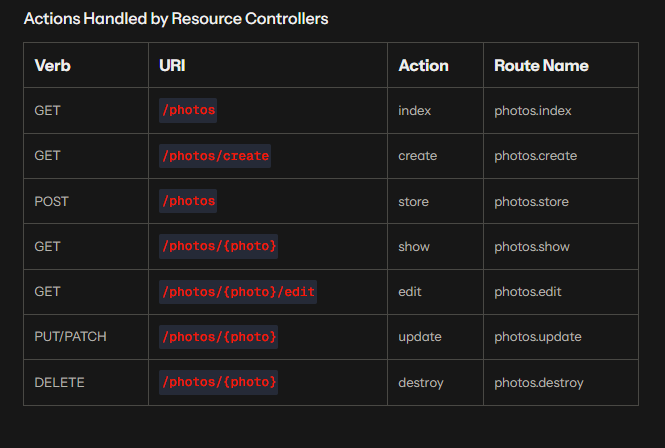

## Proyecto de pruebas

### Generar un controlador

<pre>
php artisan make:controller <NameController>
</pre>

### Generar un modelo

<pre>
php artisan make:model <NameModel>
</pre>

### Actions Handled by Resource Controllers

| Verb        | URI                    | Action  | Route Name      |
|------------|------------------------|---------|-----------------|
| GET        | /photos                | index   | photos.index    |
| GET        | /photos/create         | create  | photos.create   |
| POST       | /photos                | store   | photos.store    |
| GET        | /photos/{photo}        | show    | photos.show     |
| GET        | /photos/{photo}/edit   | edit    | photos.edit     |
| PUT/PATCH  | /photos/{photo}        | update  | photos.update   |
| DELETE     | /photos/{photo}        | destroy | photos.destroy  |

### Available Validation Rules
https://laravel.com/docs/12.x/validation#available-validation-rules

## Migraciones

php artisan make:seeder CategortTableSeeder
### Generar migracion

<pre>
php artisan make:migration <name_migration>
php artisan migrate
</pre>

### Actualizar tablas

<pre>
php artisan make:migration <name_migration> --table=<your_table>
php artisan migrate
</pre>

### Remover migración
Nota: No modificar el archivo una vez que ya fue ejecutada la migración
<pre>
php artisan migrate:rollback
</pre>

En caso de querer eliminar todas las migraciones:
<pre>
php artisan migrate:reset
</pre>

### Actualizar toda la base 
!!!(borra todo lo que se habia hecho y vuelve a crearlo)!!!

<pre>
php artisan migrate:fresh --seed
</pre>

## Seeders
Genera datos en las tablas

<pre>
php artisan make:seeder <Seeder_name>
php artisan db:seed
</pre>

### Gnerar seeder individualmente
<pre>
php artisan make:seeder <Seeder_same_name>
php artisan db:seed --class=<Seeder_same_name>
</pre>

## Factory
genera datos en modelos creados en php

<pre>
php artisan make:factory <Factory_name>
</pre>

## Middleware
los Middleware son para agregar headers en los apis
<pre>
php artisan make:middleware <Middleware_Name>
</pre>

## Events & Listeners
Events: Puede realizar una acción en segundo plano.
Listener: Escucha al evento cuando este es ejecuta.
<pre>
php artisan make:event <Event_Name>
php artisan make:listener <Listener_Name> --event=<Event_Name>
</pre>
### ShouldQueue
Ejecuta las tareas siempre y cuando se este ejecutando la siguiente linea:
Nota: Guarda todos los jobs en base y hasta que se ejecute el comando realiza la tarea ordenada. 
<pre>
php artisan queue:work
</pre>

    #lista de eventos
    php artisan event:list 

## Provider
Clase Base para proveer servicios a la aplicación
<pre>
php artisan make:provider <Provider_Name>
</pre>
## About Laravel

Laravel is a web application framework with expressive, elegant syntax. We believe development must be an enjoyable and creative experience to be truly fulfilling. Laravel takes the pain out of development by easing common tasks used in many web projects, such as:

- [Simple, fast routing engine](https://laravel.com/docs/routing).
- [Powerful dependency injection container](https://laravel.com/docs/container).
- Multiple back-ends for [session](https://laravel.com/docs/session) and [cache](https://laravel.com/docs/cache) storage.
- Expressive, intuitive [database ORM](https://laravel.com/docs/eloquent).
- Database agnostic [schema migrations](https://laravel.com/docs/migrations).
- [Robust background job processing](https://laravel.com/docs/queues).
- [Real-time event broadcasting](https://laravel.com/docs/broadcasting).

Laravel is accessible, powerful, and provides tools required for large, robust applications.

## Learning Laravel

Laravel has the most extensive and thorough [documentation](https://laravel.com/docs) and video tutorial library of all modern web application frameworks, making it a breeze to get started with the framework. You can also check out [Laravel Learn](https://laravel.com/learn), where you will be guided through building a modern Laravel application.

If you don't feel like reading, [Laracasts](https://laracasts.com) can help. Laracasts contains thousands of video tutorials on a range of topics including Laravel, modern PHP, unit testing, and JavaScript. Boost your skills by digging into our comprehensive video library.

## Contributing

Thank you for considering contributing to the Laravel framework! The contribution guide can be found in the [Laravel documentation](https://laravel.com/docs/contributions).

## Code of Conduct

In order to ensure that the Laravel community is welcoming to all, please review and abide by the [Code of Conduct](https://laravel.com/docs/contributions#code-of-conduct).

## Security Vulnerabilities

If you discover a security vulnerability within Laravel, please send an e-mail to Taylor Otwell via [taylor@laravel.com](mailto:taylor@laravel.com). All security vulnerabilities will be promptly addressed.

## License

The Laravel framework is open-sourced software licensed under the [MIT license](https://opensource.org/licenses/MIT).

## [JWT-auth](https://jwt-auth.readthedocs.io/en/develop/laravel-installation/) (JSON Web Token Authentication)

### Install via composer
Run the following command to pull in the latest version:

    composer require tymon/jwt-auth

### Publish the config
Run the following command to publish the package config file:

    php artisan vendor:publish --provider="Tymon\JWTAuth\Providers\LaravelServiceProvider"

### Generate secret key
I have included a helper command to generate a key for you:

    php artisan jwt:secret

## settings auth
change settings in next file auth.php

<pre>
    'defaults' => [
         'guard' => 'api',
        'passwords' => 'users',
    ],

    'guards' => [
        ...
        'api' => [
            'driver' => 'jwt',
            'provider' => 'users',
        ],
    ],

</pre>
